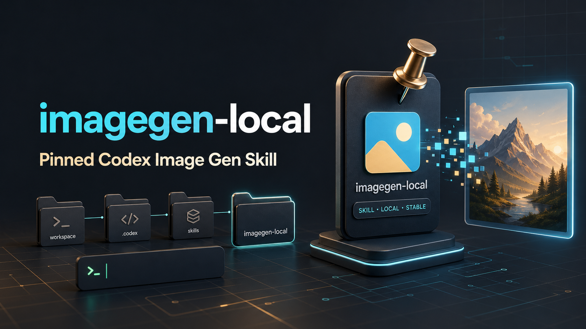

# imagegen-local



`imagegen-local` is a user-scoped pinned copy of the Codex Image Gen skill.
It is intended as a stable fallback when the bundled Codex system skill at
`~/.codex/skills/.system/imagegen` is unavailable, temporarily missing from the
Codex App skill library, or being refreshed by the Codex runtime.

## Why This Exists

The bundled `imagegen` skill can be managed by Codex App as a system asset. In
one observed environment, it disappeared from the skill library after app/runtime
restarts and later reappeared after a restart or system asset refresh.

This repository preserves a local, user-installable copy named `imagegen-local`.
The separate name is deliberate: it avoids same-name conflicts with the bundled
`imagegen` skill when both are present.

## What It Provides

- The full Image Gen skill instructions in `SKILL.md`.
- Prompting references under `references/`.
- Fallback CLI helper scripts under `scripts/`.
- Local transparent-background post-processing through
  `scripts/remove_chroma_key.py`.
- `AGENTS.md` with operational notes for future Codex agents.
- `PINNED_COPY.md` documenting the original source and pinning reason.

The built-in Codex `image_gen` tool is still the preferred path when the runtime
exposes it. This skill stabilizes the instruction bundle and local helpers; it
does not force the built-in image generation tool to appear in every session.

## Install As A Codex Skill

Clone this repository into your Codex skills directory:

```bash
mkdir -p ~/.codex/skills
git clone git@github.com:spacemoonfly/imagegen-local.git ~/.codex/skills/imagegen-local
```

If you prefer HTTPS:

```bash
mkdir -p ~/.codex/skills
git clone https://github.com/spacemoonfly/imagegen-local.git ~/.codex/skills/imagegen-local
```

Restart Codex App after installing so the skill list is refreshed.

## Verify Installation

```bash
ls -la ~/.codex/skills/imagegen-local
sed -n '1,20p' ~/.codex/skills/imagegen-local/SKILL.md
python3 -m py_compile \
  ~/.codex/skills/imagegen-local/scripts/remove_chroma_key.py \
  ~/.codex/skills/imagegen-local/scripts/image_gen.py
```

The frontmatter should show:

```yaml
name: "imagegen-local"
```

## Usage Notes

Ask Codex to use `imagegen-local` when the bundled Image Gen skill is missing or
unstable. For normal image generation, the skill should still prefer the built-in
`image_gen` tool when available. CLI fallback requires `OPENAI_API_KEY` and is
only for explicit CLI/API/model-path use cases or confirmed true transparency
fallbacks.

## HyperFrames Video Example

This repo also keeps a small HyperFrames example showing how to turn the
`imagegen-local` visual identity into a 10-second motion piece.

Example output:

- MP4: `assets/imagegen-local-10s.mp4`
- Preview frame: `assets/hyperframes-preview-5s.png`

Recommended workflow:

```bash
cd /path/to/workspace
npx --yes hyperframes@0.4.39 init imagegen-local-hypervideo \
  --example blank \
  --non-interactive
```

Use a project-local `DESIGN.md` before writing `index.html`. For this example,
the visual identity was derived from the README hero image: dark graphite
canvas, cyan glow, warm gold pin highlights, `Space Grotesk` display type, and
`IBM Plex Mono` technical labels.

Copy reusable assets into the HyperFrames project:

```bash
cp ~/.codex/skills/imagegen-local/assets/imagegen.png \
  imagegen-local-hypervideo/imagegen.png
cp ~/.codex/skills/imagegen-local/assets/readme-hero.png \
  imagegen-local-hypervideo/reference-hero.png
```

Validate before rendering:

```bash
cd imagegen-local-hypervideo
npx --yes hyperframes@0.4.39 lint
npx --yes hyperframes@0.4.39 validate
npx --yes hyperframes@0.4.39 inspect --samples 12
```

Render a 10-second 1920x1080 MP4:

```bash
mkdir -p renders
npx --yes hyperframes@0.4.39 render \
  --output renders/imagegen-local-10s.mp4 \
  --quality standard \
  --fps 30
ffprobe -v error -show_entries format=duration \
  -of default=nk=1:nw=1 renders/imagegen-local-10s.mp4
```

Expected checks from the captured example:

- `ffprobe` duration: `10.000000`
- `validate`: no console errors, all text passed WCAG AA
- `inspect --samples 12`: `0 layout issues`
- `lint`: only `composition_file_too_large`, because the example is one
  self-contained product-shot composition rather than split sub-compositions

## Maintenance

When the upstream bundled `.system/imagegen` skill changes and you want to refresh
this copy, copy the upstream files, then preserve the local skill name and local
helper paths.

Recommended local refresh outline:

```bash
SRC=~/.codex/skills/.system/imagegen
DST=~/.codex/skills/imagegen-local
rsync -a --delete --exclude='.SKILL.md.swp' "$SRC"/ "$DST"/
```

After refreshing, re-apply these local adjustments:

- `SKILL.md` frontmatter name must remain `imagegen-local`.
- Helper references should point to `~/.codex/skills/imagegen-local/...`, not
  `~/.codex/skills/.system/imagegen/...`.
- Keep this `README.md`, `AGENTS.md`, and `PINNED_COPY.md` unless intentionally
  rewriting the project docs.

Then verify:

```bash
rg -n "skills/\.system/imagegen|\.system/imagegen" ~/.codex/skills/imagegen-local
python3 -m py_compile \
  ~/.codex/skills/imagegen-local/scripts/remove_chroma_key.py \
  ~/.codex/skills/imagegen-local/scripts/image_gen.py
```

Only source-history documents such as `AGENTS.md` and `PINNED_COPY.md` should
normally mention `.system/imagegen`.
